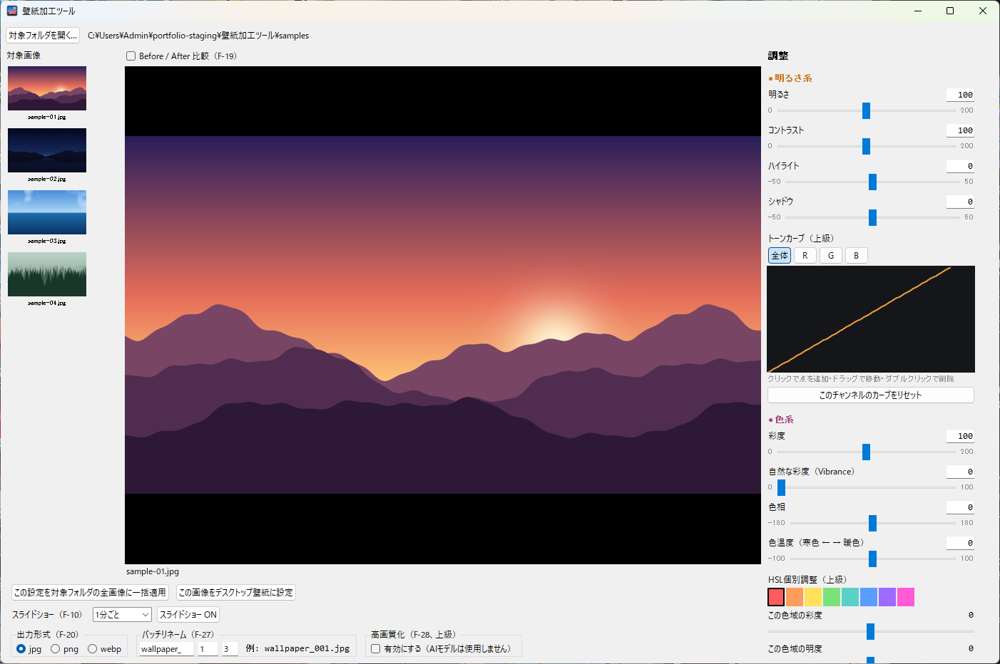

# 壁紙加工ツール（Wallpaper Editor）

フォルダ内の壁紙画像にまとめて色調補正をかけ、そのまま Windows のデスクトップ壁紙やスライドショーに設定できるデスクトップアプリです。
1枚の画像で調整しながらプレビューし、決まった設定をフォルダ内の全画像に一括で適用します。



## 主な機能

| 分類 | 機能 |
|---|---|
| 明るさ系 | 明るさ・コントラスト・ハイライト / シャドウ・**トーンカーブ**（点を追加してドラッグ、RGB チャンネル別） |
| 色系 | 彩度・自然な彩度（Vibrance）・色相・色温度・**HSL 個別調整**（色域ごとの彩度 / 明度） |
| 質感 | シャープネス・明瞭度・ビネット・ぼかし・ノイズ除去・フレーム（縁取り） |
| 変形 | 左右 / 上下反転・90度回転・トリミング・リサイズ（アスペクト比を保ったクロップ、高画質アップスケール） |
| 自動補正 | オートコントラスト・自動ホワイトバランス・適応トーン・ビビッド（ワンクリック） |
| プリセット | モノクロ・セピア・ビンテージ |
| 一括処理 | フォルダ内の全画像へ適用、出力形式（jpg / png / webp）の選択、連番リネーム。**元画像は変更しない**（別フォルダに出力） |
| 壁紙 | 選んだ1枚をデスクトップ壁紙に設定／出力フォルダ全体を**ランダム順スライドショー**に設定（間隔を選択） |
| その他 | Before / After 比較表示・調整値の保存 |

## 技術スタック

- **Python 3.12** / **Tkinter**（GUI）
- **Pillow** + **NumPy**（画像処理。トーンカーブは Catmull-Rom スプラインで LUT を生成）
- **ctypes** で Windows API を直接呼び出し
  - 壁紙の設定: `SystemParametersInfoW`
  - スライドショー: `IDesktopWallpaper` COM インターフェース（pywin32 などの追加ライブラリなしで vtable を直接呼び出し）
- **pytest**（ユニットテスト 67 件。Windows API はモックして検証）

## 設計のポイント

- **画像処理と GUI を分離**: `image_ops.py`（純粋な画像変換）・`batch.py`（一括処理）・`wallpaper*.py`（OS 連携）・`gui.py`（画面）に分け、GUI 以外はユニットテストで検証しています。
- **非破壊**: 一括加工の結果は `<元フォルダ名>_edited_<日時>` という新しいフォルダに保存し、元画像には一切書き込みません。1枚が失敗しても残りの処理は続けます。
- **依存を最小限に**: 実行時に必要なのは Pillow と NumPy だけです。高画質アップスケールも外部 AI モデルを使わず、Pillow のみ（ノイズ低減 → Lanczos 拡大 → アンシャープマスク）で実装しています。

## 開発プロセス

Claude Code を使い、**要件定義 → プロトタイプ → 詳細設計 → 実装（TDD）→ 受け入れテスト** の5段階で開発しました。
各工程の成果物はすべて [`docs/`](docs/) に残しています。

| 工程 | 成果物 |
|---|---|
| 要件定義 | [ユーザーストーリー](docs/01-requirements/user-stories.md)・[機能一覧](docs/01-requirements/feature-list.md) |
| プロトタイプ | [HTML モック](prototype/index.html)・[UI 仕様](docs/02-prototype/ui-spec.md)・[レビュー記録](docs/02-prototype/review-feedback.md) |
| 詳細設計 | [API 仕様](docs/03-design/api-spec.md)・[画面遷移](docs/03-design/screen-flow.md)・[データ設計](docs/03-design/db-design.md) |
| 実装 | [実装メモ](docs/04-implementation/impl-notes.md)・[テスト](tests/) |
| 受け入れ | [受け入れテストシナリオ](docs/05-acceptance/acceptance-scenarios.md) |

進め方のルールは [`CLAUDE.md`](CLAUDE.md)、経緯の時系列は [`docs/audit.md`](docs/audit.md) にあります。

## セットアップ（Windows 10 / 11）

1. [Python 3.10 以上](https://www.python.org/downloads/)をインストール（「Add python.exe to PATH」にチェック）
2. このリポジトリをダウンロード（`git clone` または ZIP）
3. **`setup.bat` をダブルクリック**
   仮想環境の作成 → ライブラリのインストール → テストの実行 → デスクトップにショートカット作成、まで自動で行います。

起動はデスクトップの「壁紙加工ツール」、または `run_app.bat` から。

初回は同梱の [`samples/`](samples/) フォルダ（デモ用に生成した画像）を開きます。
別のフォルダを最初に開きたい場合は、環境変数 `WALLPAPER_SOURCE_DIR` にパスを設定するか、画面左上の「対象フォルダを開く…」で選んでください。

### テストだけ実行する

```powershell
.venv\Scripts\python -m pytest tests -q
```

GUI と壁紙設定は Windows 専用ですが、テストは Docker（Linux）でも実行できます: `docker compose run --rm test`

## フォルダ構成

```
src/wallpaper_editor/
  image_ops.py            画像補正の各処理（調整・トーンカーブ・HSL・フィルタ・リサイズ）
  auto_correct.py         自動補正
  batch.py                フォルダ一括処理
  wallpaper.py            壁紙の設定（Windows API）
  wallpaper_slideshow.py  スライドショー（IDesktopWallpaper COM）
  settings.py             調整値の保存・読み込み（%APPDATA%\WallpaperEditor）
  gui.py                  Tkinter の画面
tests/                    pytest
samples/                  デモ用サンプル画像（tools/make_samples.py で生成）
prototype/                要件確認用の HTML モック
docs/                     開発工程ごとの成果物
```

## サンプル画像について

`samples/` と `prototype/assets/` の画像は [`tools/make_samples.py`](tools/make_samples.py) でプログラム生成したもので、第三者の著作物は含みません。
